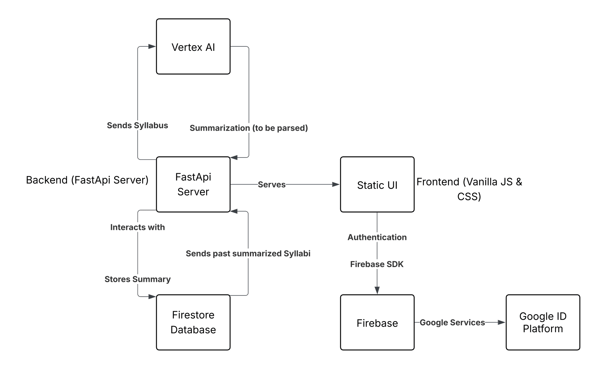

# Syllabus Summarizing Project

### URL https://cloud-final-417926879009.us-central1.run.app/

## The Problem

When taking a full workload of up to six classes, it can feel overwhelming to keep track of all the due dates and requirements for your classes. To combat this, we've developed a tool that can summarize the syllabus page of each of your classes while including all the important dates.

### Tech Stack

- The web application is built in Python using FastAPI
- The user is authenticated using Google's OAuth2
- Gemini is utilized as the LLM and called using Vertex AI
- The frontend is developed with Vanilla HTML/CSS and javascript
- A docker image of the file is stored in Googles Artifact Registry and deployed using cloud run
- All responses are stored in a firestore database

### Workflow

1. The user downloads the raw html file of their canvas syllabus page, and submits it to the application.
2. The application ingests the file, and strips out all HTML tags.
3. This text is fed, along with instructions, to Google Gemini using GCP's Vertex AI service.
4. Gemini quickly summarizes the syllabus in under 250 words, or alternatively warns the user if it submitted something that wasn't a syllabus.
5. The response is stored in google firebase and sent back to the user for review.

### Architecture

### Local Development

1. First, make a virtual environment. Run `python3 -m venv .env` (Same for mac and windows users).
2. To activate the virtual environment, run `source .env/bin/activate` (for mac) and `.env/Scripts/activate.bat` for windows.
3. Now that you are in your virtual environment, we can now install our dependencies. All the required dependencies are in the `requirements.txt` folder, so run `pip install -r requirements.txt`.
4. We now have everything we need to run our development server, so now run `uvicorn driver:app —host 0.0.0.0 —-port 8000 —-reload`.
5. Our server is up and running at `http://localhost:8000/`
